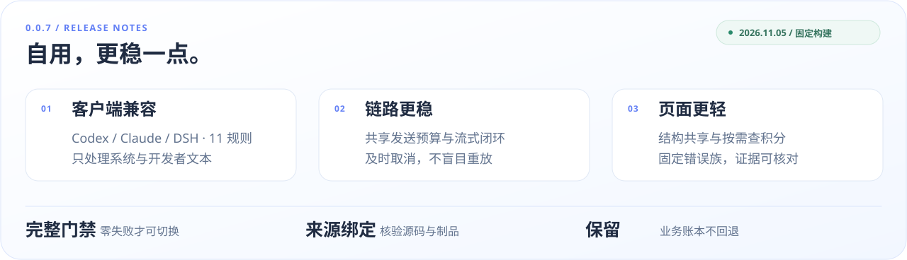

<div align="center">

<a href="https://zhihui.kaogong.art/">
  <picture>
    <source media="(max-width: 640px)" srcset="docs/images/readme/cover-mobile-v0.0.7.svg" />
    
  </picture>
</a>

<br />

**一个工作台，三条清晰的路径。**

账号、模型、密钥与用量在一起；平台的授权、边界与记录不混在一起。

<a href="https://zhihui.kaogong.art/"></a>
<a href="docs/UPGRADE-20261106.md"></a>
<a href="#开发与部署"></a>

<br /><br />

[本次更新](#007--稳定合并版) · [工作台](#看得清也用得顺) · [接入](#统一入口各有其路) · [能力边界](#把支持与不支持都讲清楚) · [开发与部署](#开发与部署)

</div>

<br />

## 0.0.7 · 稳定合并版

把已验证修复合为一个版本：客户端更兼容，页面少做重复工作，失败与恢复都有边界。

**本次增补构建：`v0.0.7+stable.20261106.1`。** 合并外部审计、此前 25 项修复、默认单密钥与邀请注册；补齐配对恢复、回执冲突保护、身份一致性与页面查询优化。[完整变更与验收边界](docs/UPGRADE-20261106.md)。源码、测试结果和现网部署身份分别留证，公开源码更新不等于已切换生产；发布状态以该构建的签名回执与 GitHub Release 为准。

**现网验收 · 2026-11-06：** 已受控切换此构建，用户确认账号页恢复。三平台账号、状态、分组及积分缓存 12 项读取通过，统计 9 项读取通过；Codex Chat / Responses、Claude Messages 与工具结果保真 4 项模型测试通过。维护时返回带中文说明、预计时长和 `Retry-After` 的 JSON 503。测试样本不代表未来零故障或所有长上下文的延迟保证。

<a href="docs/RELEASE-0.0.7.md">
  <picture>
    <source media="(max-width: 640px)" srcset="docs/images/readme/release-mobile-v0.0.7.svg" />
    
  </picture>
</a>

| 客户端兼容 | 流式与容量 | 看清每次调用 |
| :--- | :--- | :--- |
| 11 条 Codex / Claude / DSH 模板规则随版交付；只处理 WorkBuddy system/developer。 | 共享 8 次发送授权、SSE 完成与取消闭环；已接收不明不重放。 | 真实状态、有限错误族、v2 证据和只读核对；unknown 不冒充零。 |

**WorkBuddy × Codex / Claude / DSH 的特定系统模板兼容已内置。** 针对“普通 API 正常，编码客户端带完整系统上下文却返回 11128”的已复现问题，使用最小措辞或标点调整。11 条规则版本化交付，已有自定义规则保留优先级；用户、助手、工具参数与结果、图像和其他平台原文保留。规则可关闭，真实渠道拒绝仍然返回，不承诺绕过供应商授权或未来风控。[原因、规则、排查与验证 →](docs/WORKBUDDY-CODEX-COMPAT.md)

**让页面更轻，让恢复更稳。** 按需查询过期积分、失败退避、复用未变对象；跨语言续期单飞与内核锁；日志先归档校验再删除，未决和不可变证据保留。延续既有内部密钥轮换、取消关闭和双账本修复，代码回退不恢复旧账本；不新增售卖、费用运营、媒体或高级有状态 Responses。

[发布说明与边界](docs/RELEASE-0.0.7.md) · [完整更新日志](CHANGELOG.md) · [机器可读验收](ops/workbuddy-stability-0.0.7/production-verification.json) · [GitHub Release ↗](https://github.com/daniei-chen/zhihui-gateway/releases/tag/v0.0.7)

> [!NOTE]
> 测试数量必须对应具体构建，旧版或草稿 PR 的通过回执不能替代本次门禁。9 项原冻结跳过保留，未降低门槛。合成夹具不冒充所有客户端版本或供应商推理基准；真实断电、长期 SLO、国际账号真实推理与完整新主机容灾仍未验证。生产验收窗口和签名制品身份单独留证。

<br />

## 看得清，也用得顺

冰蓝、留白、轻量交互。从账号池到调用记录，一处掌握。

<a href="https://zhihui.kaogong.art/">
  <picture>
    <source media="(max-width: 640px)" srcset="site/home/preview/dashboard-mobile.jpg" />
    
  </picture>
</a>

<p align="center"><sub>实际控制台构建渲染 · 合成数据 · 非当前生产状态截图</sub></p>

- **管理不割裂。** WorkBuddy、Qoder、Trae 共用工作台，保留平台切换、明暗主题、浮动 Dock 与五语界面。
- **授权有边界。** 普通管理员可浏览脱敏信息、添加授权账号；超级管理员维护密钥额度、用户权限与系统设置。
- **用量不猜测。** 查看缓存命中、输出速度和请求记录；缺少可靠用量时显示未知，不包装成零消耗。
- **用户有自己的空间。** 独立工作台管理绑定账号、签到批次、密钥与请求记录；财务策略以已批准配置和可核验证据为准。
- **管家只做该做的事。** 基于有限脱敏证据研判，规则告警与 AI 补充分开；不授予 shell、凭据读取或自动改账权限。

<details>
<summary><b>展开更多工作面板</b> — 账号池、模型、密钥与用量</summary>

<br />

| 账号池 · 身份与状态 | 模型 · 来源与能力 |
| :---: | :---: |
|  |  |
| **密钥 · 按需授权** | **用量 · 核对每次消耗** |
|  |  |

这些是历史控制台构建的合成预览，不是另画的概念面板，也不证明供应商可用性。
[预览来源与摘要](site/home/preview/manifest.json) · [README 视觉素材清单](docs/images/readme/manifest.json)

</details>

<br />

<picture>
  <source media="(max-width: 640px)" srcset="docs/images/readme/capabilities-mobile.svg" />
  
</picture>

<br />

## 统一入口，各有其路

切换控制台视图，不会悄悄改变客户端的访问地址。

<picture>
  <source media="(max-width: 640px)" srcset="docs/images/readme/routing-mobile.svg" />
  
</picture>

| 平台 | 客户端 Base URL | 提醒 |
| :--- | :--- | :--- |
| WorkBuddy | `https://你的域名/v1` | Chat、Responses、Messages 适配 |
| Qoder | `https://你的域名/qoder/v1` | 以该引擎能力和账号授权为准 |
| Trae | `https://你的域名/trae/v1` | 以该引擎能力和账号授权为准 |

<details>
<summary><b>一个最小调用示例</b> — 使用自己已授权的模型和网关密钥</summary>

```bash
curl https://你的域名/v1/chat/completions \
  -H "Authorization: Bearer $ZHIHUI_API_KEY" \
  -H "Content-Type: application/json" \
  -d '{
    "model": "YOUR_AUTHORIZED_MODEL",
    "messages": [{"role": "user", "content": "你好"}],
    "max_tokens": 128
  }'
```

先在模型页确认实际模型 ID、平台与地区权限。网关密钥不是供应商账号授权；不要将真实密钥写入仓库、截图或工单。

</details>

[路由与权限](manager/server/routers/gateway.py) · [预算预留](manager/server/budget.py) · [不可变账本](manager/server/ledger.py)

<br />

## 把支持与不支持都讲清楚

| Responses 能力 | 当前合同 |
| :--- | :--- |
| 显式完整历史、普通工具回合、SSE、图片 | 支持并回归验证 |
| `previous_response_id` / `conversation` | 不支持服务端历史；转发前明确 400 |
| `background=true` | 不支持后台任务；明确 400 |
| `parallel_tool_calls=false` / 函数 `strict=true` | 上游不能保证；明确 400，不静默忽略 |
| 自定义工具 grammar | 仅描述性提示，不宣称严格执行 |

> [!IMPORTANT]
> **失败不等于零费用，取消不等于供应商停止。** 处理状态不明时保留 unknown；发送与响应头事件不是供应商账单。版本回退只回退代码，不回退刚产生的消费、授权或会话撤销记录。

<details>
<summary><b>展开可靠性与恢复边界</b></summary>

- 主账本采用 WAL/FULL，但物理持久性仍依赖操作系统与存储；进程崩溃恢复测试不是生产断电试验。
- 双账本快照以 main→wallet 顺序短暂获取写锁。完整性与业务一致性检查、隔离恢复在复制后进行。
- 恢复只写新隔离目录，禁用调用、撤销旧会话、封存凭据，不将旧余额直接启用。
- 内部密钥已轮换；代码回滚保留新密钥，不重新启用已经撤销的旧凭据。
- 现网采用排空后受控切换，有短维护窗口，不宣称零停机。历史 unknown、弱口令告警和其余审计项独立跟进。

</details>

<br />

## 开发与部署

**Python 3.12 · Node.js 22+ · Next.js 16 · React 19**

```bash
git clone https://github.com/daniei-chen/zhihui-gateway.git
cd zhihui-gateway
```

| 你的目标 | 从这里开始 |
| :--- | :--- |
| 本地运行、改版或贡献 | [开发指南](docs/DEVELOPMENT.md) · [控制台源码](src/three-platform/web/) · [Manager](manager/server/) |
| 理解版本、签名与回滚 | [产品发布合同](docs/PRODUCT-RELEASE.md) · [0.0.7 验收](docs/RELEASE-0.0.7.md) |
| 查看首页与视觉实现 | [首页源码](site/home/index.html) · [集成与复现](site/home-source/INTEGRATION.md) |
| 追溯实现及剩余工作 | [完整更新日志](CHANGELOG.md) · [历史审计边界](docs/AUDIT-0.0.3.md) |

本地开发不是一键安装完整三平台服务。引擎、账号授权、认证与持久化需要单独配置，静态导出也不包含后端。

```text
固定来源 → 构建与隔离测试 → 哈希、签名与回执 → 受控发布 → 运行核验
```

**不要把 GitHub 自动源码包当作生产安装包。** 现有受控实例仅使用受信发布器，不直接覆盖运行目录，不执行 `git pull && restart`，也不为回退代码恢复旧业务数据库。公开 tag 的提交记录与现网签名清单分别留证，不互相冒充。

<br />

## 致谢与许可

智汇在既有组件上持续演进。感谢 WorkBuddy Manager contributors、workbuddy2api、Qoder / Trae 相关项目与 [linux-do/cdk](https://github.com/linux-do/cdk) 的界面基础。

产品源码采用 [MIT](LICENSE)。组件版权与第三方声明见 [Manager LICENSE](manager/LICENSE)、[来源声明](manager/UPSTREAM-NOTICES.md)；模型与账号授权遵循各自服务条款，不绕过供应商授权限制。

封面、能力卡片与路由图为可编辑、自包含 SVG，没有外部字体、脚本或远程图片依赖。历史首页扫描素材及衍生海报遵循原 CC BY-SA 4.0，相关许可与原创替换范围见[首页集成说明](site/home-source/INTEGRATION.md)。

<div align="center">
<br />
<a href="https://zhihui.kaogong.art/"></a>
<p><sub>智汇 ZHIHUI · 少一点喧闹，多一点可控。</sub></p>
</div>
